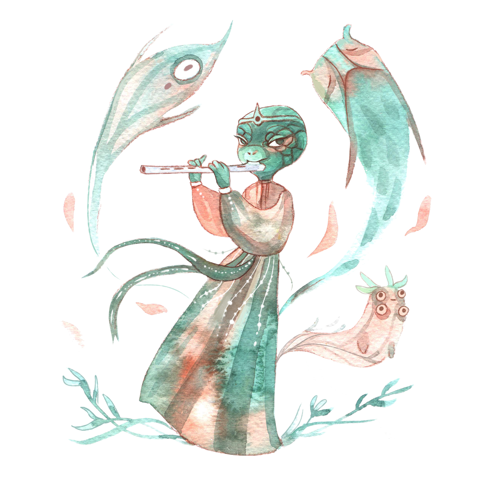
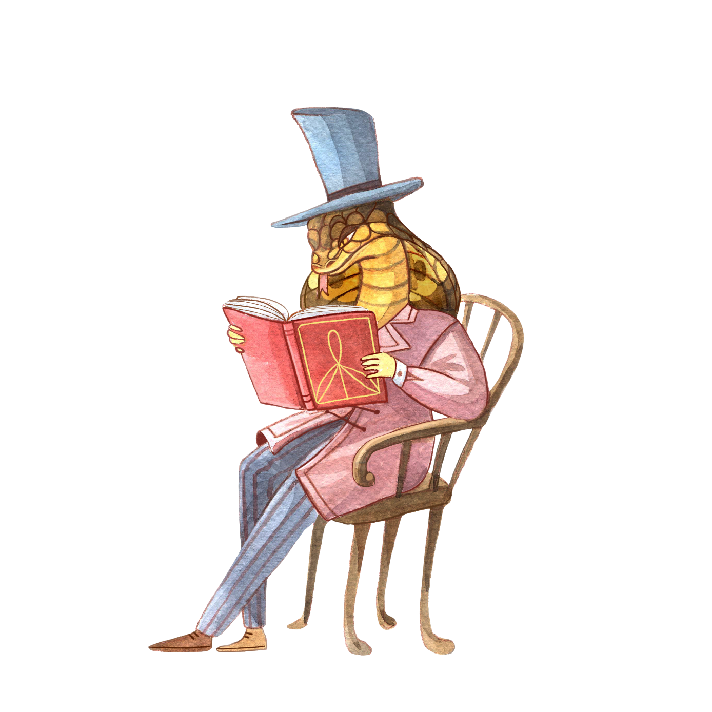

There are six kinds of folk who live in the Karst Archipelago: the Eekhorn, Grevlings, Lagartos, Serpos, Veldlings, and Visita. Some settlements and islands may have more of one folk than the others, but, by and large, the circumstances in the archipelago have drawn them together.

There are physical, mental, and cultural differences between the folk, but their intellect and abilities are similar. Mechanically, the only differences between them are their different special abilities. The one exception are the Lagartos, who face a few additional restrictions due to their smaller size.

## Eekhorn

_A bushy-tailed, nut-loving folk, the Eekhorn are known for being high energy, high strung, and quick to action._

Hailing from the Eastern Woods, the Eekhorn are the descendants of an ancient tree-dwelling race. They possess large, bushy, tails and a good sense of balance, making them naturally adept at climbing.

The Eekhorn have a reputation for being quick to act and even quicker to react. At its best, this trait manifests as decisive, bold, and adaptive leadership. More negativity, it can be expressed as an impulsive, unfocused, and unreliable temperament.

There are few Eekhorn in the Karst Archipelago, as very few of its settlements were founded by their kind. The small number of Eekhorn who do call the archipelago home are mostly found in the nautical trade, as their innate balance and aptitude for climbing makes them natural sailors. The Eekhorn community is scattered about the ships and ports of the archipelago, with its heart in Eektorp Bay, a bustling and dirty port of call.

As the climate of the archipelago is warmer than most Eekhorn prefer, many shear tattoo-like patterns into their fur as a stylish method of keeping cool.

## Grevling

_A sturdy, skeptical, folk, Grevlings have a reputation for grumpy perseverance._

Stoic, clannish, and skeptical, the Grevlings have inhabited the Eastern Woods since time immemorial – once in fear, but now as its master. The history and identity of this proud folk revolves around the campaigns they waged to beat back the Vulfs and civilize the woods. True, the Eekhorn helped, but it was the indomitable spirit of the Grevlings that led the day and kept the light alive even in the darkest winters of the war.

Grevlings have a hard time giving up, backing down, or being killed. They are built of heavier bones than the other folk and their dense coat protects them equally from the heat of the sun and the cold of winter.

Like the Eekhorn, there are very few Grevlings in the archipelago, especially in its southern reaches. The reasons are similar to those of the Eekhorn – the folk of the Eastern Woods weren’t as interested in the Karst Archipelago as some of the other folk. Still, most every town has at least a Grevling or two – if not a small community – and often in some role at the center of things, as many a Grevling reluctantly finds themselves.

Possessing short, slick, fur with a distinctive black and white pattern, Grevlings often dress in the traditional clothes of the Eastern Woods, no matter the weather. These woven garbs with ample pockets are utilitarian and comfortable enough.

## Lagartos

_Bright, dexterous, and charming, the diminutive Lagartos are known as a clever folk, for better and worse._

Native to the shores of the Southern Swamps, it was the Lagartos who were the first modern inhabitants of the archipelago. Standing no taller than the shoulders of most other folk, the spritely Lagartos move with a nervous and unsettling haste.

Lagartos are born problem solvers, with a fondness for unconventional solutions – and the occasional blind spot for unintended consequence. Genius or troublemaker, plenty of Lagartos have been called both, often in the same breath. An industrious bunch, these reptilian folk work with the same hasty energy that permeates their other activities and it is no exaggeration to say that life in the archipelago would fall apart if every Lagartos were to take a single day off at once.

The Lagartos who left the Southern Swamps and resettled in the archipelago were separatists from the floating cities, a society created in partnership with the Visita. At the heart of their dispute was their belief that spiritual guidance should take a lead role in governance – an idea that the Visita nobles would have none of. The independent and spiritual bent of these first settlers set the tone for future migrants, lending the folk of the archipelago a reputation for self-reliance and superstition. Many of the island chain’s communities can still trace their heritage back to the early Lagartos, a point of pride for some of the oldest villages and ports.

The warm climate of the Karst Archipelago suites the cold-blooded Lagartos almost perfectly. Here, they are able to dress as the please with little concern for the effects of cold weather. Some Lagartos wear sweeping robe-like clothes inspired by Serpos and Visita fashions, but most prefer close cut outfits that are less likely to get snagged or otherwise hinder movement.

## Serpos

_Ancient and learned, the Serpos are an empathic and insightful folk with a dark and complicated past._

Long has the gaze of the Serpos graced this world. From the Western Sands their empire arose, built atop the Thaumaturgical arts – a gift taught to Serpos by the wind itself. For millennia, these serpentine folk ruled the desert sands, subjugating its other inhabitants, the Veldlings. Like the desert sun, harsh and unrelenting was their rule. Under the lead of the Serpos – watered by the blood of the Veldlings – the Empire grew to dizzying heights.

But all things pass, and so did the fortunes of the First Serpos Empire eventually wane. After centuries of corruption and internal turmoil, their society and empire collapsed when the Veldlings fled, taking with them the empire’s chief source of labor and artisans. Within a decade, a millennia of progress had come crashing down, the empire reduced to a collection of warring tribes.

The Serpos are a learned folk, and have become much wiser for these past mistakes. In the shadows of their failed empire they have rebuilt and reimagined their culture and beliefs. Memories are long and grudges are held even longer. To this day, many folk still do trust the Serpos at face value, a lamentable – but understandable – fate.

While Serpos are something of a rarity in the present day archipelago, more than a few of the islands are home to the ruins of ancient outposts from the early days of their empire. The Serpos who call these islands home are a varied lot: merchants, scholars, bakers, and laborers – but all possess a certain understanding, one that either humbles or instills within them a strange and ancient arrogance.

## Veldling

_Possessing an entrepreneurial spirit, the Veldling make for gracious hosts and brave, but measured, adventurers._

Born of the Western Sands, the Veldlings were driven out of their homelands some five centuries ago, following a long period of oppression at the hands of the Serpos. Fleeing across the Mirror Sea, these furry and resilient folk resettled in the Eastern Woods alongside the Grevlings and Eekhorn.

Veldlings are brave – but measured – folk. They know that discretion is often the better part of valor, a trait that makes for fine adventurers. As careful as they are, they are equally – if not more-so – ambitious. A sociable lot, most Veldlings enjoy the situations that arise from interpersonal interactions, good or bad. These aspects of the Veldlings' psyche help explain why many traveling merchants, ship captains, and shopkeepers are members of this entrepreneurial folk.

A mid-point in the journey between the Western Sands and the Eastern Woods, many Veldlings chose to make the Karst Archipelago their new home instead of traveling further. Here, in the relatively sparsely populated archipelago, they found respite, their settlements. Some five centuries later, they remain a large portion of the archipelago’s residents.

As one of the two most common folk in the archipelago, Veldlings are found on almost every inhabited island. Aspects of their culture, from their native tongue and shipbuilding techniques, to their propensity for hilltop shrines have become foundational parts of life in the archipelago.

## Visita

_Stalwart, just, even-keeled, and benevolent, the Visita are regarded as a regal, if a bit self-confident, folk._

The Visita were born in the waters of the Southern Swamps. There was abundance in the swamp, but it was murky. And so, as a Visita grows from egg to tadpole to fully fledged frog, so too have the Vista grown as a folk, first by leaving the waters of the swamps and constructing vast floating cites beside its banks, and then by leaving the swamps themselves and exploring the seas and continents, forming mercantile bonds and trading with those around them.

The Visita have never really had it hard. There were no Vulfs to fear or rival species to hate. The waters of the southern swamps provided a home and a steady source of food and the floating cities were created from surplus, rather than constructed as a defense. Even more, the Lagartos did not oppose the Visita's encroachment onto the land, but instead saw the opportunity to fill in the margins of their society and share in the abundance.

The goddess Woggles, oft associated with the Visita, embraced and understood the changing nature of life far more than the others, something that is reflected in this folk. There is an order to life and a course to it. Change is inevitable, but it seasonal and there are patterns. There are ups and downs, but in the end, things turn out well for the Visita because things always turn out well for the Visita.

This mindset can be a little problematic. It is difficult for a Visita to fully appreciate when the odds are against them and good luck trying to convince one that they are wrong or dissuade them from a course they have set upon. A Visita will genuinely listen to and take the advice of their subjects, companions, and compatriots, but it can be a little tricky for a Visita to give up the reigns of power unless it is to someone of a clearly higher station.
