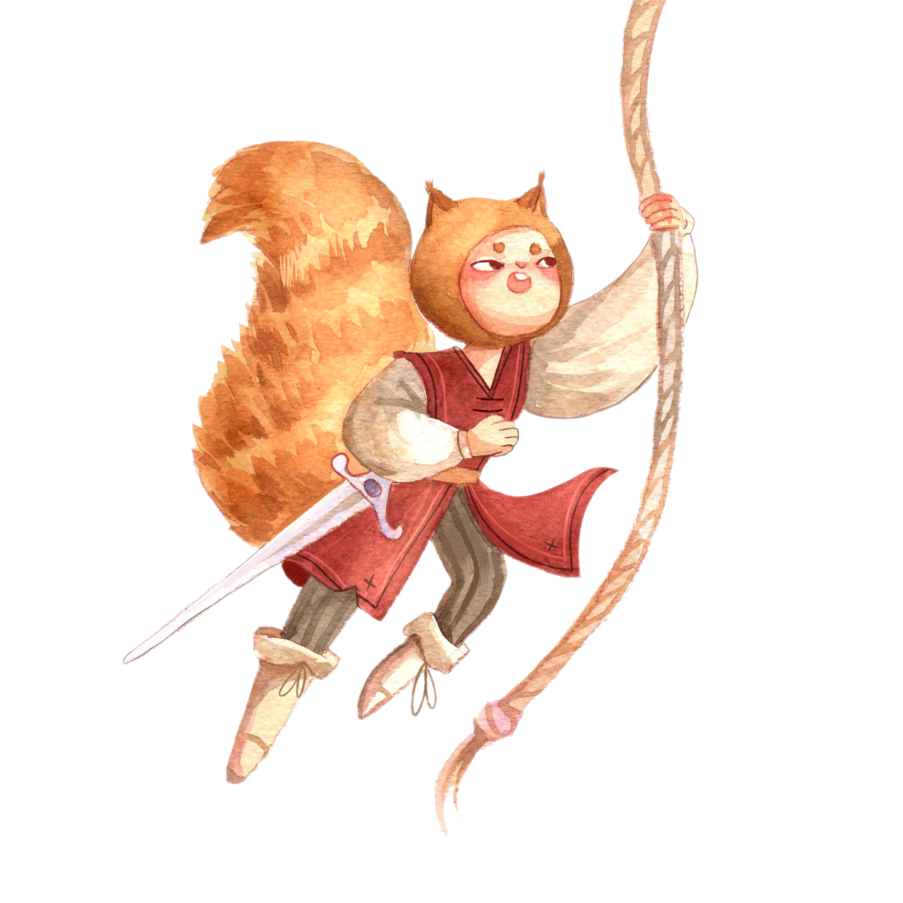
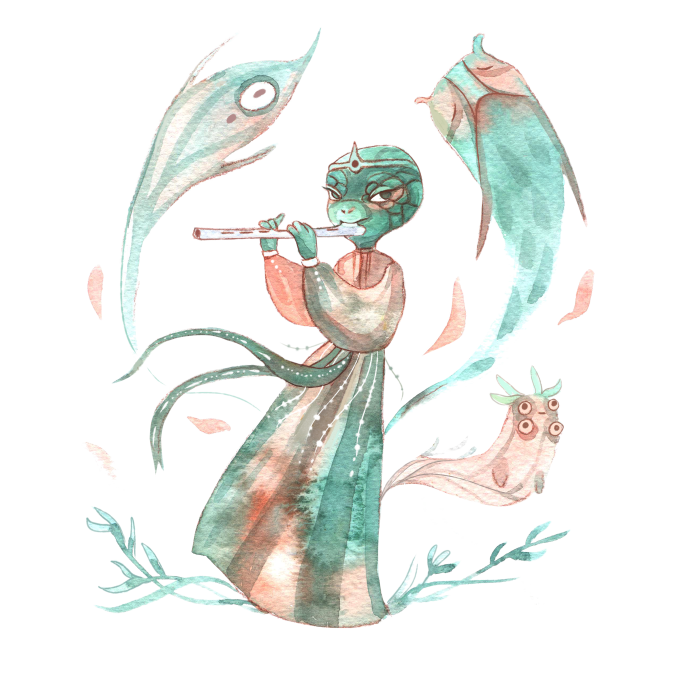

import SpeciesAbilityDisplay from '../../components/RulesetDisplay/SpeciesAbilityDisplay';

The world of Karst is one with multiple sentient species of roughly the same intellect, size, and capabilities. Collectively these species refer to themselves as the Folk. Of note, there is no dominant species among the folk, this is not "the Age of the Visita", or anyone else. Though each species has a homeland and areas where they are more populous, folk frequently intermingle, especially out in the Archipelago where circumstance have drawn many closer together.

These are the the sentient species that make up the primary inhabitants of the Karst Archipelago.

## Eekhorn

_A bushy-tailed, nut-loving folk, the Eekhorn are known for being high energy, high strung, and quick to action._

### Abilities

<SpeciesAbilityDisplay species="Eekhorn" />

### About

Hailing from the Eastern Woods, the Eekhorn descended from an ancient tree-dwelling race. They possess large, bushy, tails and a good sense of balance, making them naturally adept at climbing.

The Eekhorn have a reputation for being high-strung, quick to act, and even quicker to react. At its best, this trait manifests as decisive, bold, and adaptive leadership. More negativity, it can be expressed as an impulsive, unfocused, and unreliable temperament.

There are relatively few Eekhorn in the Karst Archipelago, but those that are, are involved in nautical trades to higher degree than other folk. The simple explanation is that their innate balance and aptitude for climbing make the Eekhorn natural sailors. In truth, it is also because there are very few settlements that were originally founded by the Eekhorn in the Karst archipelago. The sole exception, Eektorp Bay, is, naturally, a sailing hub and major port of call.

The climate of the archipelago is warmer than most Eekhorn prefer, leading many to shave parts of their fur in tattoo like patterns as a stylish method of keeping cool.

## Grevling

_A sturdy, skeptical, folk, Grevlings have a reputation for keeping social organizations together._

### Abilities

<SpeciesAbilityDisplay species="Grevling" />

### About

Sturdy, clannish, and skeptical, the Grevlings have inhabited the Eastern Woods since time immemorial, once in fear, but now as its master. The history and identity of this proud Folk revolves around the campaigns they waged to beat back the Wolves, and civilize the Woods. Yes, the Eekhorns helped, but it was the indomitable spirit of the Grevlings and their priests that led the day when all seemed lost in the darkest of winter.

## Lagartos

_Bright, dexterous, and charming, the diminutive Lagartos are known as a clever folk, for better and worse._

### Abilities

<SpeciesAbilityDisplay species="Lagartos" />

### About

Native to the shores of the Southern Swamps, the Lagartos are a clever folk. The were quick to join with the Visita when the latter began building floating cities along the banks of the swamps. The arrangement worked out well for both folk, with the Lagartos content to let the Visita assume public leadership while they went about installing themselves as the power behind the throne.

While they are often praised for being industrious and busy, the Lagartos also have a bit of a bad reputation. Not every Thief is a Lagartos, not by a long shot, but it's no coincidence that the Thieves' Speak is a dialect of the old Lagartos tongue.

## Serpos

_Some folk have issue trusting the Serpos at face value, but none can deny their deep insight and wisdom._

### Abilities

<SpeciesAbilityDisplay species="Serpos" />

### About

Sharp-eyed, methodical, wise, cold, ancient. The Serpos can trace the history of their culture back to the ancient days when they were one of the great empires. The modern-day Serpos, inhabitants of the Western Sands, live in the shadows of their once glorious past, metaphorically and physically.

As the first folk to discover the Art of Thaumaturgy, the ancient Serpos were able to forge a civilization and dominate the landscape around them. As their empire grew, so did their embrace of corruption as Deceit became practiced at the highest levels of their leadership.

They subjugated and dominated their neighbors, the Veldlings, who eventually fought back, leading to a protracted war and the beginning of the end for the first Serpos empire. Though they ultimately drove the Veldlings from the Western Sands, it came with the use of great magic and even greater sacrifices, crippling and bankrupting the civilization both morally and economically.

In the centuries since, the Serpos have slowly rebuilt and emerged as a more agreeable and collaborative folk, but old prejudices, suspicions, and bad-blood still haunt their reputation. While their powers have greatly diminished, they remain a highly-educated people, placing much stock in the pursuit of knowledge and secrets.

## Veldling

_Possessing an entrepreneurial spirit, the Veldling make for gracious hosts and brave, but cautious, adventurers._

### Abilities

<SpeciesAbilityDisplay species="Veldling" />

### About

Originally from the Western Sands, the Veldlings were driven out of their homelands by the Serpos centuries ago after a long period animosity between the two Folk. Most Veldlings resettled in the Eastern Woods alongside the Grevlings and Eekhorn, but many found their way to the Karst Archipelago, where they remain today.

Veldlings are brave, but measured, folk. They know that discretion is often the better part of valor, a trait that makes for fine adventurers. As careful as they are, they are equally (if not more-so) ambitious. Furthermore, they are a sociable lot and enjoy the situations that arise from interpersonal interactions. These aspects of the Veldlings' psyche help explain why many traveling merchants, ship captains, and shopkeepers are members of this entrepreneurial folk.

## Visita

_Stalwart, Just, Even-Keeled, Charming, and Benevolent, the Visita are regarded as a regal and storied folk._

### Abilities

<SpeciesAbilityDisplay species="Visita" />

### About

The Visita have always been leaders. From their birth in the backwaters of the Southern Swamps, to the rise of their floating cities along the tributaries of the great river, to the dawn and expansion of their seaborne mercantile empire, the Visita have stood for progress, prosperity, and nobility.
