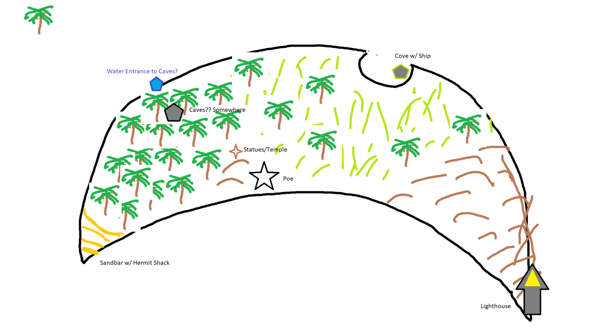
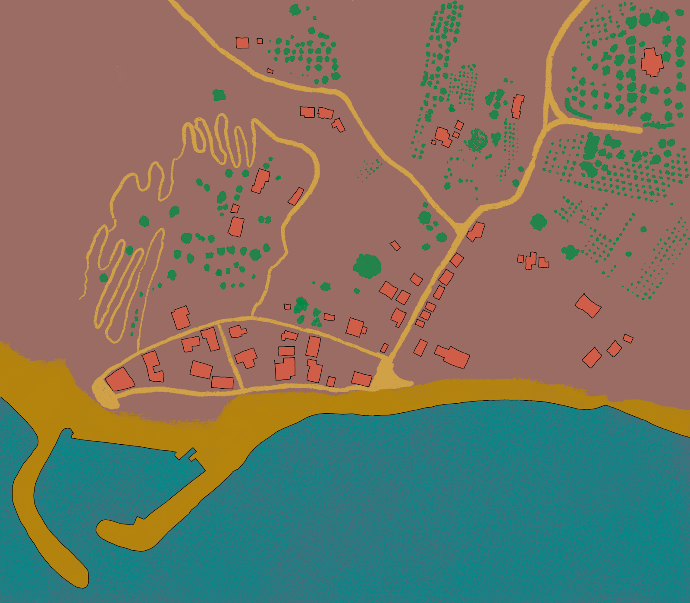
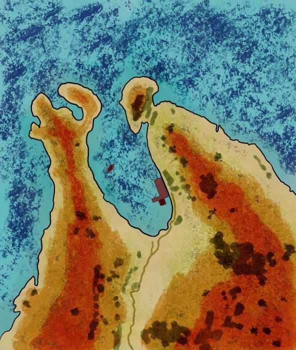

## Belagoria

Our adventure began here. It's Glenn's hometown.

## Gygalos Island

The place we shipwrecked in session 1.

A crescent shaped island. We wrecked on one end of the crescent, and on the other end we have bluffs and a lighthouse. Whole island is about 8 miles long.

[🦀 Beasts of Gygalos Island](/story/monsters/mnstrs_of_gygalos)

### Poe Village

A village in Gygalos Island. The squiggly path goes up a hill, there are deific statues there.

Locations:

- Carapaceria

### Northern Cove of Gygalos Island

Wrecked Ship

- Needs ~8 folk to pull it out of the water
- Needs ~5 Planks to repair holes

Ominous Quartz Statues

- Crab folk like
- Red crystals in their hearts

Herd of Tiger Beetles

## Drakt Harbor

Here there be pirates. Somewhere between Eektorp Bay and Belagoria.

## Quill Island

A day’s journey to the southeast from Gygalos Island, Quill Island is known as the island of pines and tears.

## Eektorp Bay

The Derrington's original destination, before it wrecked near Gygalos
Island
